# Statistical Thinking — End to End

A complete, progressively deep reference on statistical thinking — from where it came from, to how to reason with data, to how to avoid being fooled by it.

**How this repo is organized:**
- This README is the full map of the subject: for every topic and subtopic, a **definition**, a **real-life example**, and a **small diagram**.
- Each topic below will also get its own folder with a deep-dive notebook, added progressively as I work through it.
- Order matters — later topics lean on earlier ones, so read top to bottom the first time through.

---

## 0. A Brief History of Statistics

Statistics didn't start as a branch of math — it started as a tool of the state. The word itself comes from the Latin *status* ("state"), because early "statistics" simply meant facts collected by governments: population counts, tax records, military manpower. Ancient Babylon, Egypt, China, and Rome all ran censuses for exactly this reason.

- **1654 — Birth of probability theory.** Blaise Pascal and Pierre de Fermat exchanged letters solving a gambling dispute (how to fairly split stakes in an interrupted game). This correspondence is considered the formal beginning of probability theory.
- **1663 — John Graunt and the first data analysis.** Graunt studied London's weekly "Bills of Mortality" and found stable patterns in births, deaths, and causes of death — the first time someone extracted general laws from raw records. This is often called the birth of demography.
- **1763 — Bayes' theorem.** Thomas Bayes' essay on inverse probability was published posthumously, laying the foundation for what we now call Bayesian statistics — though it wouldn't be widely used for another two centuries.
- **Early 1800s — Gauss and Laplace.** Carl Friedrich Gauss and Pierre-Simon Laplace developed the normal distribution and the method of least squares (for fitting lines to noisy astronomical data), and laid the groundwork for the Central Limit Theorem.
- **1835 — Quetelet and "the average man."** Adolphe Quetelet applied statistical methods to human traits (height, weight, behavior) for the first time, founding social statistics — controversial then and now for how it treated deviation from the average.
- **1880s — Galton: regression and correlation.** Francis Galton, studying how children's heights relate to their parents', discovered that extreme traits "regress" toward the average in the next generation, and developed the concept of correlation.
- **1900s — Karl Pearson.** Pearson formalized the correlation coefficient and the chi-squared test, and founded the world's first university statistics department.
- **1920s–30s — Ronald Fisher.** Fisher invented ANOVA, formalized p-values and significance testing, and wrote *The Design of Experiments* — effectively inventing modern experimental design and randomization.
- **1930s — Neyman–Pearson framework.** Jerzy Neyman and Egon Pearson formalized hypothesis testing as we teach it today: null vs. alternative hypotheses, Type I and Type II errors.
- **1970s–80s — Computational statistics.** Bradley Efron introduced the bootstrap, using computing power to estimate uncertainty without heavy theoretical assumptions — a turning point toward modern, simulation-based statistics.
- **2000s–today — Causal inference and data science.** Judea Pearl formalized causal reasoning with DAGs and do-calculus. Bayesian methods, once too computationally expensive, became mainstream via MCMC. Statistics merged with computer science to form modern data science and machine learning.

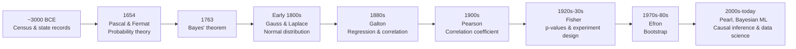

---

## 1. Foundations

### 1.1 Data Types
**Definition:** Data is either *qualitative* (categories — nominal or ordinal) or *quantitative* (numbers — discrete or continuous, measured on interval or ratio scales). The type of data determines which statistics and charts are even valid to use.

**Real-life example:** In a customer survey, "country" is nominal (no order), "satisfaction rating (1–5)" is ordinal (ordered, but gaps aren't equal), "number of purchases" is discrete quantitative, and "amount spent in $" is continuous ratio data (has a true zero).

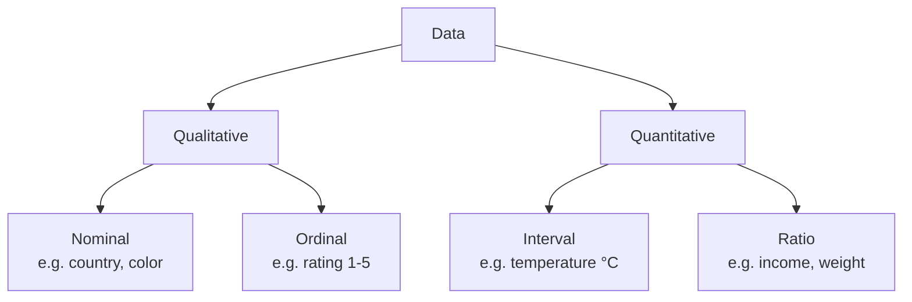

### 1.2 Descriptive Statistics
**Definition:** Descriptive statistics summarize a dataset with single numbers — mean, median, mode, variance, standard deviation — to describe its center and spread without listing every value.

**Real-life example:** Five employees earn 30k, 31k, 29k, 32k, and 500k. The **mean** ($124.4k) is dragged upward by the one outlier and misleadingly suggests everyone is well-paid; the **median** ($31k) reflects what a typical employee actually earns.

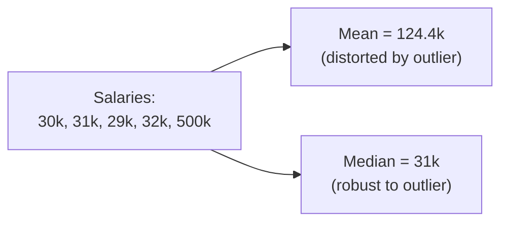

### 1.3 Skewness & Kurtosis
**Definition:** Skewness measures the asymmetry of a distribution (which side has the longer tail); kurtosis measures how heavy the tails are compared to a normal distribution (how likely extreme values are).

**Real-life example:** Household income is typically right-skewed — most people earn a moderate amount, but a long tail of very high earners stretches the distribution to the right, pulling the mean above the median.

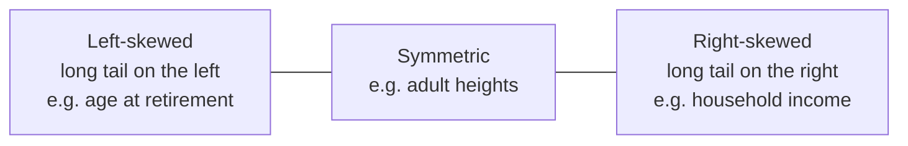

### 1.4 Visualization Principles
**Definition:** Good visualization choices reveal the true shape of data; bad ones (wrong chart type, truncated axes, poor binning) can hide or distort it, even with correct numbers.

**Real-life example:** A bar chart showing "average daily temperature = 20°C" hides the fact that days were either a cold 10°C or a hot 30°C, never actually 20°C — a histogram of daily temperatures reveals this two-cluster (bimodal) pattern instantly.

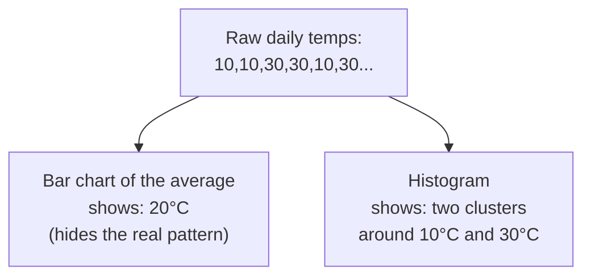

---

## 2. Probability Theory

### 2.1 Axioms & Conditional Probability
**Definition:** Probability follows three basic axioms (values between 0 and 1, certainty = 1, additive for mutually exclusive events). Conditional probability, P(A|B), is the probability of A *given that* B has already happened, and updates as new information arrives.

**Real-life example:** P(rain today) = 0.3. But P(rain | sky is cloudy this morning) = 0.7 — knowing it's cloudy changes the probability estimate substantially.

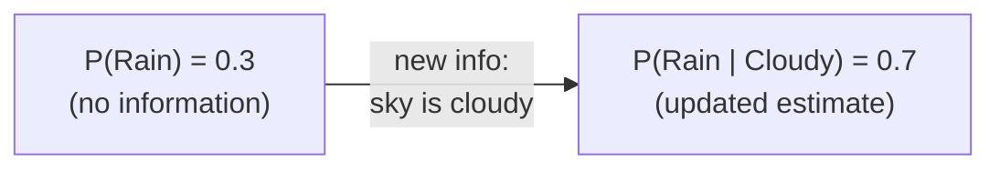

### 2.2 Bayes' Theorem
**Definition:** Bayes' theorem describes how to update the probability of a hypothesis given new evidence: Posterior ∝ Likelihood × Prior.

**Real-life example:** A disease affects 1 in 10,000 people. A test is 99% accurate. Someone tests positive — but because the disease is so rare, Bayes' theorem shows the true probability they're actually sick is still under 1%, not 99%.

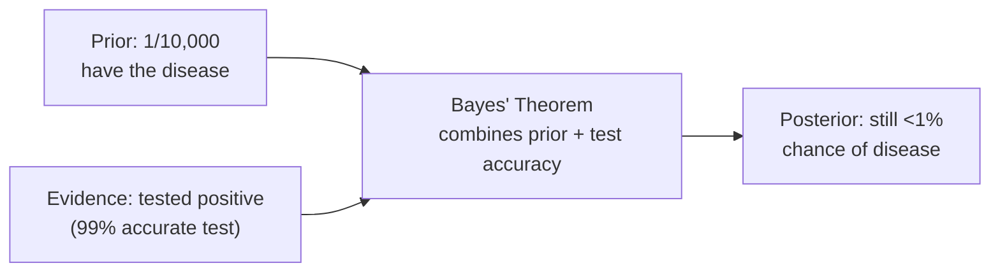

### 2.3 Random Variables (PMF / PDF / CDF)
**Definition:** A random variable maps outcomes of chance to numbers. A PMF gives probabilities for discrete outcomes, a PDF gives density for continuous outcomes, and a CDF gives the probability of being at or below a value.

**Real-life example:** For a fair coin flip, the random variable X = 1 for heads, 0 for tails. The PMF is P(X=1) = 0.5, P(X=0) = 0.5. The CDF at X=0 is 0.5 (probability of getting tails or less).

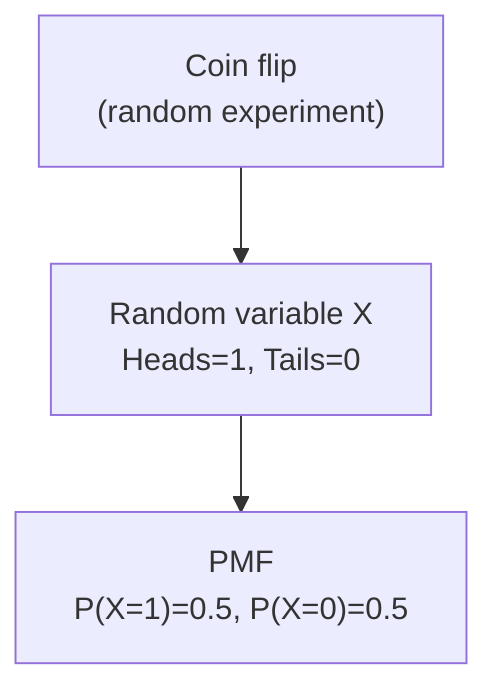

### 2.4 Key Distributions
**Definition:** Distributions describe how probability is spread across possible outcomes. Different real-world processes naturally follow different shapes: Binomial (fixed number of yes/no trials), Poisson (count of rare events over time), Normal (continuous, symmetric), Exponential (time between events).

**Real-life example:** Number of heads in 10 coin flips → Binomial. Number of customer support emails in an hour → Poisson. Adult human heights → Normal. Time until the next bus arrives → Exponential.

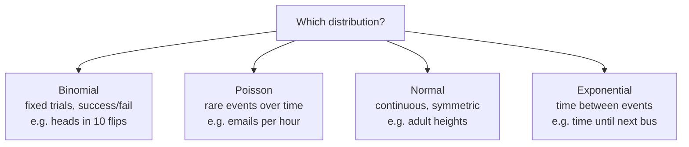

### 2.5 Law of Large Numbers & Central Limit Theorem
**Definition:** The Law of Large Numbers says that as sample size grows, the sample average converges to the true population average. The Central Limit Theorem says that the *distribution of sample means* becomes approximately normal as sample size grows, regardless of the original data's shape.

**Real-life example:** Flip a coin 10 times — you might get 70% heads. Flip it 10,000 times — the proportion converges to 50%. If you repeat the 10,000-flip experiment many times and plot all the resulting averages, that plot looks like a normal curve, even though a single flip is binary.

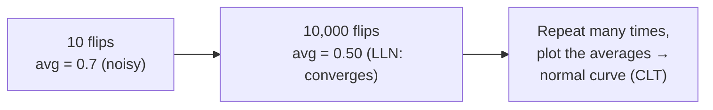

---

## 3. Inferential Statistics

### 3.1 Sampling Distribution & Standard Error
**Definition:** A sampling distribution is the distribution of a statistic (like the mean) across many different samples from the same population. The standard error measures how much that statistic is expected to vary from sample to sample.

**Real-life example:** If you poll 100 different random groups of 500 voters each, each poll gives a slightly different result (51%, 53%, 49%...). Those results cluster tightly around the true population value — that spread is the standard error.

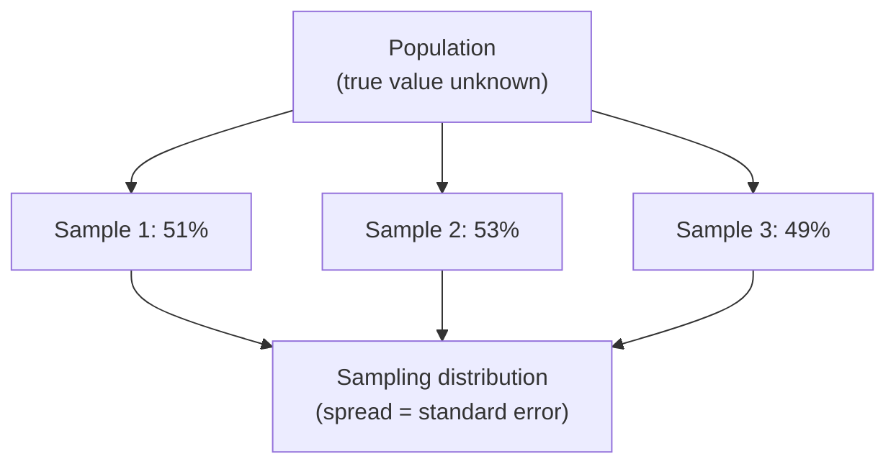

### 3.2 Confidence Intervals
**Definition:** A confidence interval gives a range of plausible values for a population parameter. A 95% CI means: if you repeated the sampling process many times, 95% of the resulting intervals would contain the true value — it does *not* mean "95% chance the true value is in this specific interval."

**Real-life example:** A poll reports "52% support, ±3% margin of error, 95% confidence." This means the true support level is most likely between 49% and 55%, and this method would capture the true value 95% of the time it's used.

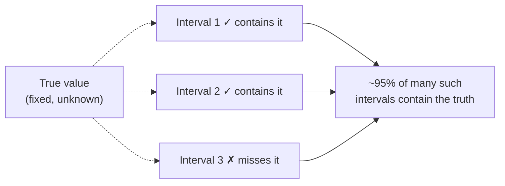

### 3.3 Hypothesis Testing & p-values
**Definition:** Hypothesis testing checks whether observed data is consistent with a "null hypothesis" (usually "no effect"). The p-value is the probability of seeing data this extreme (or more) *if the null hypothesis were true* — it is not the probability the hypothesis is true.

**Real-life example:** Testing a new drug against a placebo gives p = 0.03. This means: if the drug truly had no effect, results this strong would occur only 3% of the time by chance — evidence against "no effect," but not proof the drug works.

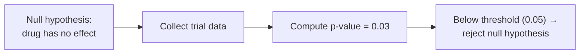

### 3.4 Multiple Testing & p-hacking
**Definition:** Multiple testing is the problem of running many statistical tests at once — the more tests you run, the higher the chance one becomes "significant" purely by luck. P-hacking is exploiting this, deliberately or not, by testing many things and only reporting what looks significant.

**Real-life example:** Test 20 unrelated hypotheses (does jellybean color X cause acne?) at the standard 5% significance level. Purely by chance, you'd expect about 1 of the 20 to come back "statistically significant" — even if none of them are actually true.

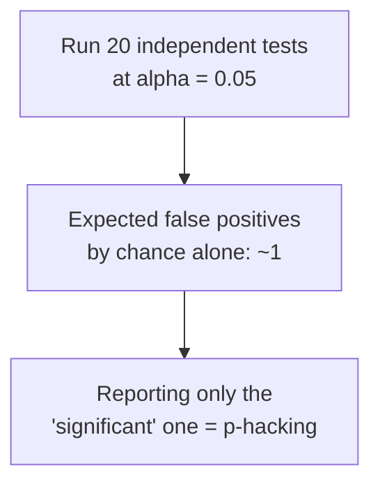

---

## 4. Bayesian Statistics

### 4.1 Prior, Likelihood, Posterior
**Definition:** The *prior* is your belief before seeing data, the *likelihood* is how probable the observed data is under different hypotheses, and the *posterior* is your updated belief after combining the two.

**Real-life example:** You believe a coin is probably fair (prior). You flip it 10 times and get 8 heads (likelihood favors a biased coin). Combining both, you update to "the coin is probably slightly biased toward heads" (posterior) — not fully convinced it's rigged, but more suspicious than before.

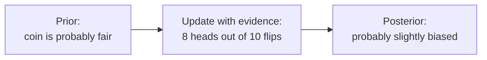

### 4.2 Bayesian vs. Frequentist Interpretation
**Definition:** Frequentists treat an unknown parameter as a fixed, single true value and describe uncertainty via how a procedure behaves over many repeated samples. Bayesians treat the parameter itself as having a probability distribution, representing a degree of belief that updates as evidence arrives.

**Real-life example:** Asked "what's the chance this coin is biased?" — a frequentist designs a test and reports a p-value about the *procedure*; a Bayesian directly states "there's a 70% probability the coin is biased," updating that number as more flips come in.

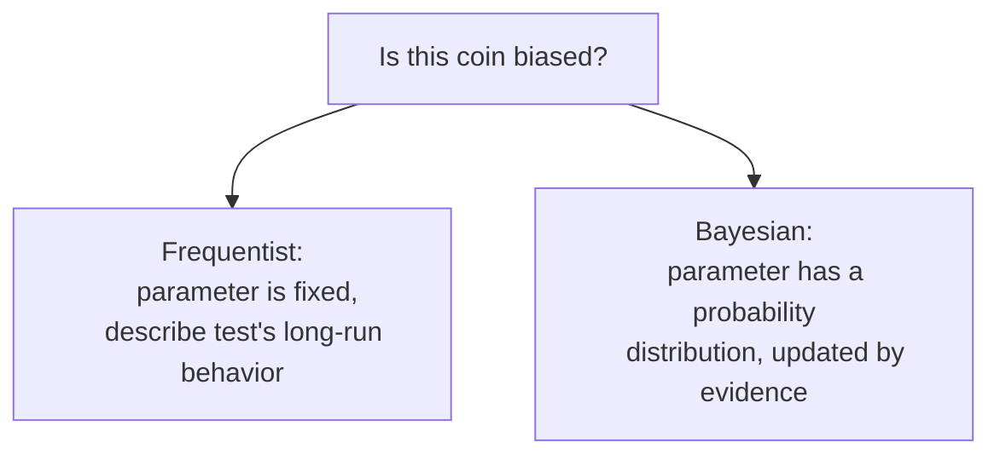

### 4.3 Credible Intervals
**Definition:** A credible interval is the Bayesian counterpart to a confidence interval — it gives a range where the parameter falls with a stated probability, directly (e.g., "95% probability the true value is between 0.4 and 0.6").

**Real-life example:** After updating on flip data, a Bayesian might report "there's a 95% probability the coin's true bias is between 0.55 and 0.75" — a direct probability statement, unlike a frequentist confidence interval.

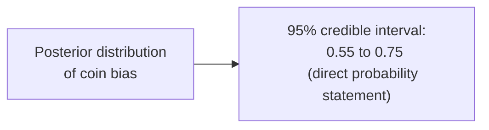

---

## 5. Regression & Modeling

### 5.1 Linear Regression
**Definition:** Linear regression models the relationship between a continuous outcome and one or more predictors as a straight line, estimating how much the outcome changes per unit change in a predictor.

**Real-life example:** Modeling weight from height finds each extra inch of height is associated with about 2.5kg more weight on average — the fitted line lets you predict weight for a new height value.

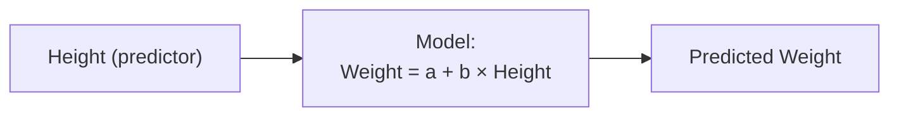

### 5.2 Logistic Regression
**Definition:** Logistic regression models the probability of a binary outcome (yes/no) as a function of predictors, using a sigmoid curve to keep predictions between 0 and 1.

**Real-life example:** Predicting pass/fail from hours studied: instead of a raw score, the model outputs something like "80% probability of passing" for a student who studied 6 hours.


### 5.3 Regularization (Ridge / Lasso)
**Definition:** Regularization adds a penalty for large coefficients to a regression model, shrinking unimportant predictors toward zero to prevent overfitting when there are many features relative to data points.

**Real-life example:** With 100 candidate predictors but only 50 patients in a medical study, regularization shrinks the coefficients of irrelevant predictors close to zero, keeping the model from "memorizing" noise.

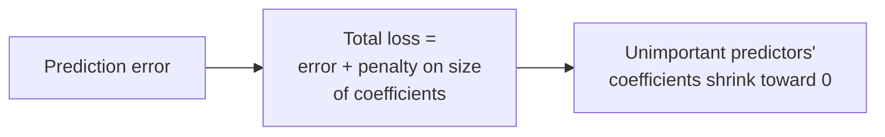

### 5.4 Multicollinearity & Diagnostics
**Definition:** Multicollinearity occurs when predictors are highly correlated with each other, making it hard for a regression model to isolate each one's individual effect and causing unstable coefficient estimates.

**Real-life example:** Using both "height in cm" and "height in inches" as separate predictors in the same model breaks it — they carry identical information, so the model can't tell which one "deserves" the credit.

```mermaid
graph LR
    A["Height (cm)"] <-->|"perfectly correlated"| B["Height (inches)"]
    A --> C["Unstable,
    unreliable coefficients"]
    B --> C
```

---

## 6. Causal Inference

### 6.1 Correlation vs. Causation
**Definition:** Two variables being correlated (moving together) does not mean one causes the other — the relationship could be coincidence, or both could be driven by a third, unmeasured factor.

**Real-life example:** Ice cream sales and drowning deaths both rise in summer and are strongly correlated — but ice cream doesn't cause drowning. Hot weather (a third factor) drives both.

```mermaid
graph TD
    Heat["Summer heat"] --> Ice["Ice cream sales ↑"]
    Heat --> Drown["Drowning deaths ↑"]
    Ice -.->|"looks correlated,
    not causal"| Drown
```

### 6.2 Confounders & Colliders
**Definition:** A *confounder* is a variable that a  influences both the presumed cause and the outcome, creating a spurious association. A *collider* is a variable influenced by two other variables — conditioning on it can create a *fake* association between those two variables that didn't exist before.

**Real-life example (confounder):** Coffee drinkers appear to have more heart disease — but smoking (a confounder) makes people more likely t
